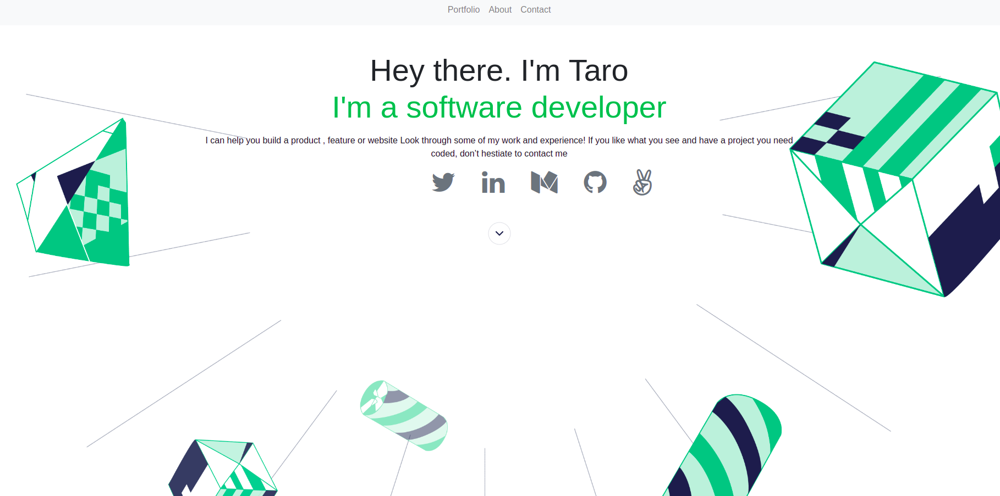

# Portfolio with Bootstrap

> Building a Portfolio to show what I'm truly capable of as a developer, as well as showing my future recruiters and hiring managers to get an idea of what I can bring to their teams.




Additional description about the project and its features.

## Live 
[Click here to see live](https://tchilo.github.io/Bootstrap-project3/)

## Built With

- Major languages
- Bootstrap


## Getting Started

**To get a copy of this repo into your local machine run the following command:**
```
git clone git@github.com:Tchilo/Bootstrap-project3.git 
cd Bootstrap-project3
in visual studio code you can click the go live button to view it live in the browser.
```

## Author

👤 **Taro Chilongoshi**

- GitHub: [@Tchilo](https://github.com/Tchilo)


## 🤝 Contributing

Contributions, issues, and feature requests are welcome!

Feel free to check the [issues page](../../issues/).

## Show your support

Give a ⭐️ if you like this project!


## 📝 License

This project is [MIT](./MIT.md) licensed.
